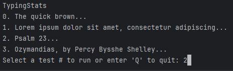
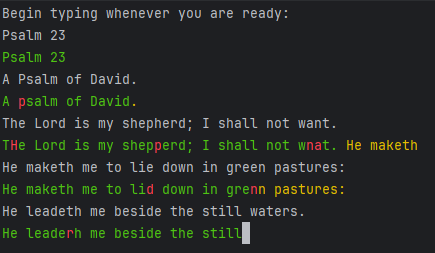

# TypingStats

## About

This is a simple command-line program developed in 2025 by Jed Schaaf as a capstone project for NCLab's Python training course.

It requires the [readchar](https://pypi.org/project/readchar/) library from PyPI to be installed: `pip install readchar`.

The program compares keyboard-typed user input against a user-supplied or user-selected test file and calculates several typing statistics, including typing accuracy as a percentage of correctly typed keys and speed as measured via keys-per-second (kps) and words-per-minute (wpm). The test file can be any input that Python can open as a file and read as text. User input comes from stdin (usually the keyboard).

## Using the program

The text from the test file will be displayed line-by-line, with user input interspersed after each line. Correct, incorrect, extra, and missed characters are displayed as the user types them in.

If the user makes a mistake, the current line can be corrected using backspace to delete the last character or ctrl+backspace to delete the last set of alphanumeric characters or the last set of whitespace and punctuation. The corrected text will count in favor of accuracy, but will also affect the kps and wpm measurements.

If the user does not wish to finish the entire test file, any of <kbd>Ctrl</kbd>+<kbd>C</kbd>/<kbd>Q</kbd>/<kbd>Z</kbd>, or <kbd>ESC</kbd> may be pressed to interrupt the testing and calculate the results up to that point.

## Calling the program from the command line

The program may be called with two optional parameters:

- `--input=[input\file\path]` or `-if=[input\file\path]` will automatically start a test using the specified file.

- `--output=[output\file\path]` or `-of=[output\file\path]` sets the file where the results are to be saved. The default is "./results.txt".

One input and one output specifier can be used.

## Test files

Additional test files can be added to the menu by giving them a name starting with "test" and a ".txt" extension and putting them into the "/tests" subdirectory.

### Included test files

- test0.txt is a short sentence test that uses every letter in the English alphabet. It is split to several lines to test multi-line typing.
- test1.txt is the full paragraph of "Lorem Ipsum" dummy Latin(-ish) text to test sight-typing and letter recognition-based typing speed and accuracy without using many of the common letter/word combinations that appear in English text.
- test2.txt is the 23rd Psalm, which uses some archaic early modern English words and phrasing.
- test3.txt is _Ozymandias_, a short poem by Shelley.
